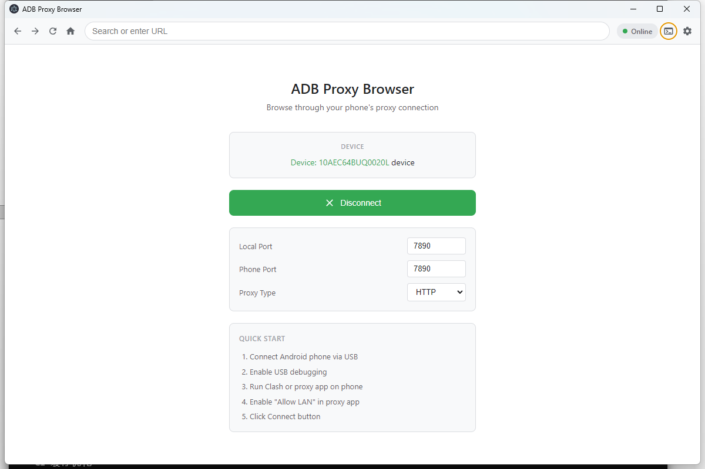
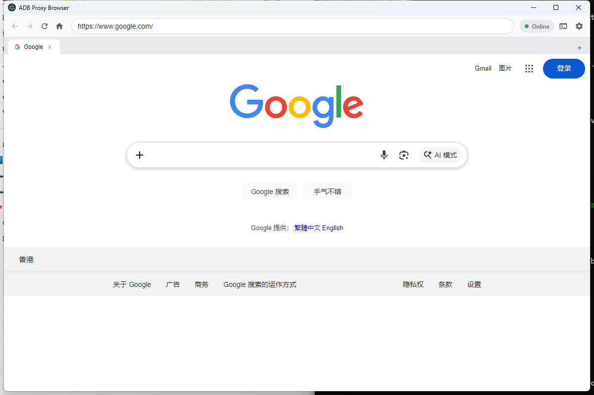
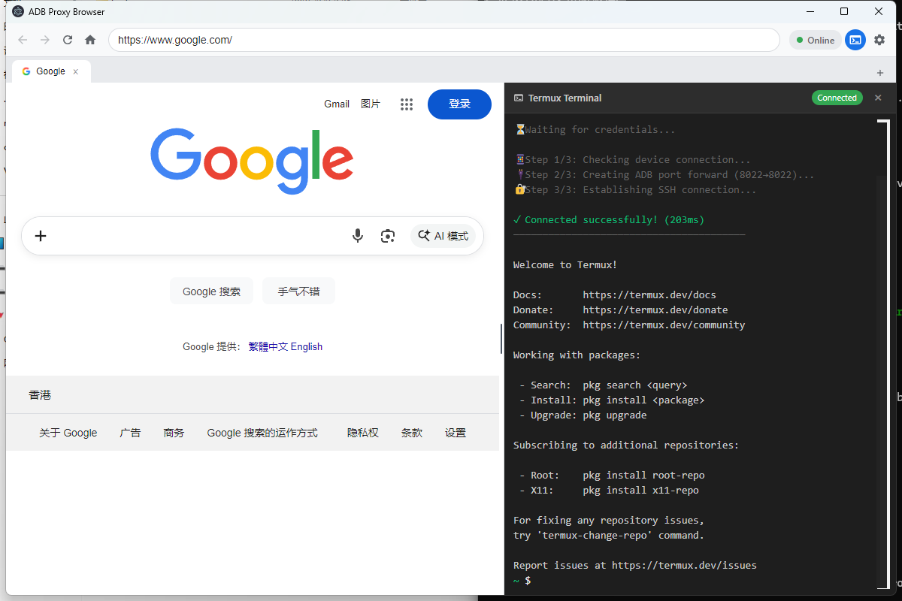

<div align="center">

# 🌐 ADB Proxy Browser

**Route your PC traffic through your Android phone's proxy via USB**

*A lightweight Electron browser with built-in ADB tunnel support*

[](https://github.com/Bahtya/adb-proxy-browser/releases)
[](https://github.com/Bahtya/adb-proxy-browser/stargazers)
[](https://github.com/Bahtya/adb-proxy-browser/releases)
[](LICENSE)
[](https://github.com/Bahtya/adb-proxy-browser/releases)


</div>

---

<div align="center">

### ⭐ If this project helps you, please give it a star!


</div>

---

## 📸 Preview

<div align="center">

| Welcome Screen | Browser View | Terminal Panel |
|:--------------:|:------------:|:--------------:|
|  |  |  |
| *Device detection & connection* | *Full browser experience* | *SSH to Termux* |

</div>

---

## ✨ Features

<table>
<tr>
<td width="50%">

### 🔌 One-Click Connection
- Automatic Android device detection
- No external ADB binary required
- Built-in platform tools download

### 🌍 Built-in Browser
- Chrome-like tabbed interface
- URL suggestions from history
- Bookmarks support

</td>
<td width="50%">

### 🔒 Proxy Support
- HTTP & SOCKS5 protocols
- Works with Clash, V2Ray, Shadowsocks
- System-wide proxy configuration

### 💻 Terminal Access
- Built-in SSH to Termux
- xterm.js powered terminal
- Direct phone shell access

</td>
</tr>
</table>

---

## 🚀 Quick Start

### Prerequisites

| Requirement | Details |
|-------------|---------|
| 📱 **Android Phone** | USB debugging enabled, proxy app running (Clash/V2Ray/etc.) |
| 💻 **PC** | USB drivers installed |
| 🔧 **Proxy App** | "Allow LAN connections" enabled |

### Installation

Download the latest release for your platform:

[](https://github.com/Bahtya/adb-proxy-browser/releases/latest)
[](https://github.com/Bahtya/adb-proxy-browser/releases/latest)
[](https://github.com/Bahtya/adb-proxy-browser/releases/latest)

### Usage

```
1. Connect phone via USB
2. Start proxy app on phone (enable "Allow LAN")
3. Launch ADB Proxy Browser
4. Click "Connect"
5. Browse the internet through your phone's proxy!
```

---

## 📊 How It Works

```
┌─────────────┐      ┌─────────────┐      ┌─────────────┐      ┌─────────────┐
│   Browser   │ ───▶ │ Local Proxy │ ───▶ │ ADB Tunnel  │ ───▶ │ Phone Proxy │
│   (PC)      │      │  (7890)     │      │  (USB)      │      │  (Clash)    │
└─────────────┘      └─────────────┘      └─────────────┘      └─────────────┘
                                                                      │
                                                                      ▼
                                                               ┌─────────────┐
                                                               │  Internet   │
                                                               └─────────────┘
```

---

## 🛠️ Advanced Usage

### Using with Other Applications

The app creates a local proxy at `127.0.0.1:7890`. Any application can use it:

<details>
<summary><b>📋 System-wide Proxy (Windows)</b></summary>

```
Settings → Network & Internet → Proxy → Manual proxy setup
- Address: 127.0.0.1
- Port: 7890
```

</details>

<details>
<summary><b>🌐 Browser Extension (Proxy SwitchyOmega)</b></summary>

1. Install [Proxy SwitchyOmega](https://github.com/FelisCatus/SwitchyOmega)
2. Create new profile → Proxy
3. Protocol: SOCKS5 or HTTP
4. Server: `127.0.0.1`, Port: `7890`

</details>

<details>
<summary><b>💻 Command Line Tools</b></summary>

```bash
# curl
curl -x http://127.0.0.1:7890 https://example.com

# git
git config --global http.proxy http://127.0.0.1:7890

# npm
npm config set proxy http://127.0.0.1:7890

# pip
pip install package --proxy http://127.0.0.1:7890
```

</details>

<details>
<summary><b>🐍 Python</b></summary>

```python
import requests

proxies = {
    "http": "socks5://127.0.0.1:7890",
    "https": "socks5://127.0.0.1:7890",
}
response = requests.get("https://example.com", proxies=proxies)
```

</details>

---

## 💻 Terminal (SSH to Termux)

Access your phone's shell directly from the app!

<details>
<summary><b>Setup Termux SSH Server</b></summary>

```bash
# 1. Install Termux from F-Droid (recommended)

# 2. Install OpenSSH
pkg update && pkg install openssh

# 3. Set password
passwd

# 4. Find your username
whoami

# 5. Start SSH server
sshd

# (Optional) Auto-start on launch
echo 'sshd' >> ~/.bashrc
```

</details>

---

## 🔧 Build from Source

```bash
# Clone repository
git clone https://github.com/Bahtya/adb-proxy-browser.git
cd adb-proxy-browser

# Install dependencies
npm install

# Run in development
npm start

# Build for production
npm run build:win    # Windows
npm run build:mac    # macOS
npm run build:linux  # Linux
```

---

## 📈 Project Stats

<div align="center">

| Stats | Badge |
|-------|-------|
| **Stars** |  |
| **Forks** |  |
| **Issues** |  |
| **Downloads** |  |
| **Contributors** |  |
| **Last Commit** |  |

</div>

---

## 🤝 Contributing

Contributions are welcome! Here's how you can help:

[](https://github.com/Bahtya/adb-proxy-browser/pulls)

1. **Fork** the repository
2. **Create** a feature branch (`git checkout -b feature/amazing-feature`)
3. **Commit** your changes (`git commit -m 'Add amazing feature'`)
4. **Push** to the branch (`git push origin feature/amazing-feature`)
5. **Open** a Pull Request

---

## 📝 License

This project is licensed under the MIT License - see the [LICENSE](LICENSE) file for details.

---

## 🙏 Acknowledgments

- [Electron](https://www.electronjs.org/) - Cross-platform desktop apps
- [adbkit](https://github.com/OpenSTF/adbkit) - Pure JavaScript ADB implementation
- [xterm.js](https://xtermjs.org/) - Terminal emulator
- [ssh2](https://github.com/mscdex/ssh2) - SSH2 client

---

<div align="center">

### ⭐ Star History

[](https://star-history.com/#Bahtya/adb-proxy-browser&Date)

**[⬆ Back to Top](#-adb-proxy-browser)**

---

*Made with ❤️ by [Bahtya](https://github.com/Bahtya)*

</div>
